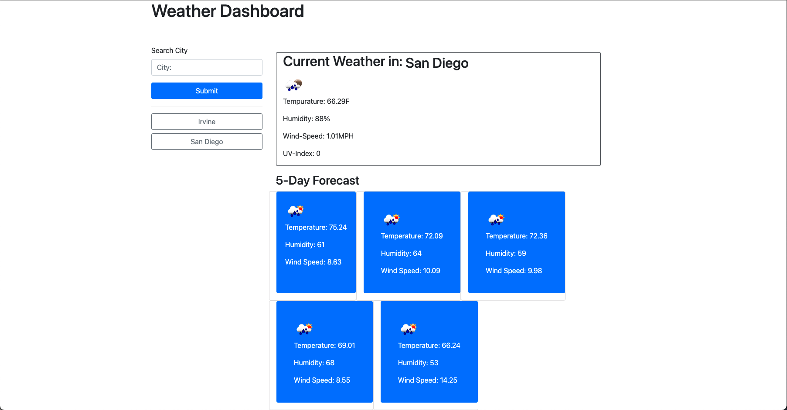

# weather-dashboard

## Description 
This is a Weather Dashboard app where the user can search for a city and it will display the current weather as well as the 5 day forecast 

## Installation 
- Clone repository or follow link to the launched application 

## Instructions 
- Enter city into the search bar
- The city will display on the main card, as well as its 5 day forecast below. 
- The input will save below the search bar, and the user can click and revisit the previous city

## Website
- https://github.com/mojikalani/weather-dashboard
- https://mojikalani.github.io/weather-dashboard/